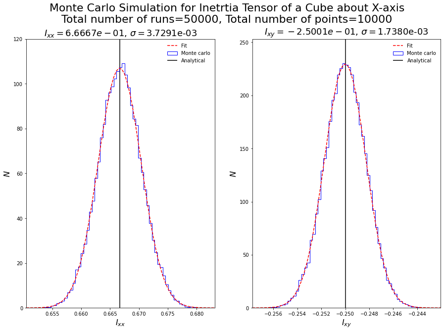

# Moment of Interia

Moment of inetrtia inertia of a solid uniform cube about one of it's edge is calculated using Monte Carlo simulations and the results are compared with the analytical solution.
Numba is used to speed up the process.

Before the use of Numba the simulation with (10000,10000)[(number of runs, number of points in each run)] was taking around 20-30 minutes now with numba implemented it's taking around 1-1.5 minutes so there is significant improvement in the computation speed. For (50000,10000) simulation is taking around 5-6 mins.
